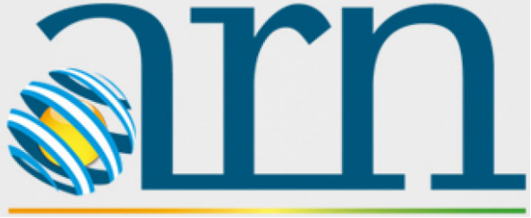
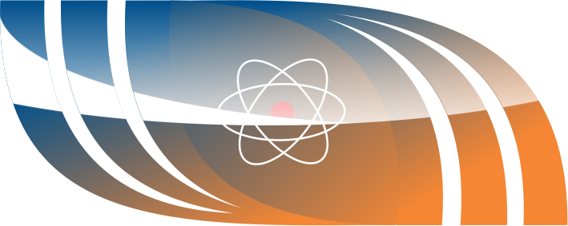
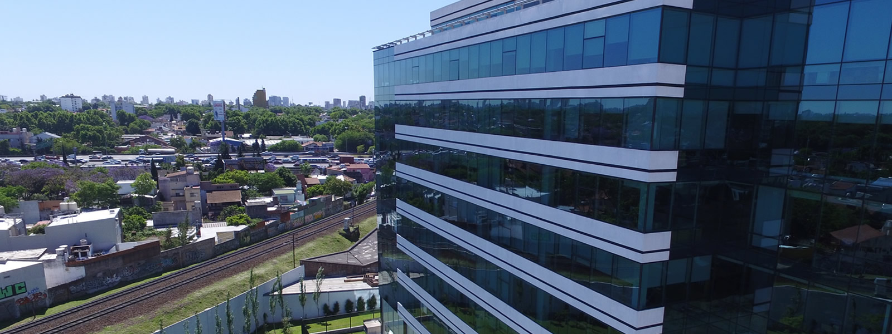

 
 
 

## Grupo Argentino de Cálculo y Análisis de Reactores 2023 - IX Reunión

---

**5 y 6 de diciembre en NASA, Edificio Nodus**, Laprida 3163, Villa Martelli, Vicente López, Buenos Aires.

**7 de diciembre de 2023, Visita a Atucha/CAREM**, Salida desde Sede CNEA, Libertador 8250, CABA.

**Sala de reunión virtual:** https://meet.google.com/xtz-ayho-ovc

**Contacto:** Martín Silva, msilva@na-sa.com.ar, Tel: 011 5129 7700 int. 58529, WA: 341 6 044740

---

## Cronograma
### Martes 5 de diciembre - Nodus - Sala José Balseiro (Piso 5):

 Hora | Expositor | Institución  | Título
:---:|:---:|:---:|:---:
 8:00 |  |  | Acreditación en Recepción de NA-SA (planta baja)
 9:00 | M. Silva | NASA | Sesión de inicio, preliminares y programación.
 9:20 | E. Villarino | Anses  | Coondorcito 1d multigroup CP module.
 9:40 | M. Lemes | CNEA | Modelado de ATF en el código de combustible Dionisio.
 10:00 | G. Theler* | Seamplex  | Sobre la verificación de un Solver neutrónico con el método de soluciones fabricadas.
 10:20 | | | Pausa para el café.
 10:40 | J. Beliera | CNEA  | Avances en desarrollo de código de celda.
 11:00 | C. Dacal | CNEA  | Avances en el desarrollo de código nodal.
 11:20 | K. Pennington | NASA  | Cálculo de reactor con solver PETSc en DiNO.
 11:45 | | | Almuerzo en comedor Nodus.
 13:30 | **Mesa Redonda** Modera:.M.Silva|  | Necesidades de desarrollo y perspectivas de colaboración entre instituciones.
 15:30 | || Planificación día 2. Cierre de sesiones día 1.

##### \* Expone en forma virtual

---

### Miércoles 6 de diciembre - Nodus - Sala José Balseiro (Piso 5):

Hora | Expositor | Institución |  Título
:---:|:---:|:---:|:---:
9:00 | M. Silva | NASA | Reapertura. Sesión día 2.
9:20 | D. Ferraro | INVAP  | Highly-detailed neutronic and thermal-hydraulic coupled calculations for Research Reactors.
9:40 | D. Orradre | NASA  | Modelado de accidentes en CNA-UII mediante códigos acoplados
10:00 | | | Pausa para el café.
10:20 | M. Montaño Rojas, B.Gray | INVAP  | ¿Cómo se asegura que un diseño radiológico nuclear es conservativo?
10:40 | F. Khatchikian | NASA  | Estimación del quemado de las barras de control de Atucha 1.
11:00 | P. Brahim | NASA  | Optimización de la estrategia de recambio ULE de Atucha-II con método de recocido simulado.
11:20 | J. Benito | ARN | Modelo neutrónico de HPR-1000 con la línea de cálculo CONDOR-CITVAP.
11:45 | | | Almuerzo en comedor Nodus.
13:30 | **Mesa Redonda** Modera:.D.Ferraro|  | Avances en los cálculos para reactores PWR.
15:30 | || Planificación visita CNA-CAREM. Cierre de sesiones día 2.

---

### Jueves 7 de diciembre - Visita Atucha/CAREM:
#### Traer DNI y credencial de institución

Hora | Lugar | Actividad
:---:|:---:|:---:
7:00 | Sede Central CNEA - Av. del Libertador 8250, CABA | Parte minibus de CNEA hacia Sitio Atucha
8:30 | Portería del Complejo Nuclear Atucha | Acreditación
09:00 | Sala de Visitas CNA | Recepción – Provisión de elementos de protección personal
09:15 | Sala de Visitas CNA | Video y presentación institucional  
10:15 | CNA | Recorrido por la zona convencional de la Unidad II 
11:15 | CNA | Almuerzo en Sala de Visitas 
11:45 | CNA | Fin de la visita en CNA y partida hacia el CAREM
12:00 | CAREM | Ingreso / Provisión de EPPs
12:15 | CAREM | Recorrido por obra
13:00 | CAREM | Charla / presentación
14:30 | Fin de la visita y retorno al minibus
16:00 | **Estimado** | Llegada a Buenos Aires y fin de la reunión.

---

## Cena de camaradería:
Fecha tentativa el miércoles 6 en horario y lugar a confirmar.

